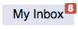

# jquery.badge

This is a simple jQuery plug-in to overlay a badge on top of another element on a page. Such badges are commonly used as notification counters on icons or buttons to alert users that they have new content waiting for them.

To use it, copy the `jquery.badge.js` and `jquery.badge.css` files into your project and load them where needed:
```html
<script src="jquery.badge.js"></script>
<link rel="stylesheet" type="text/css" href="jquery.badge.css">
```

Then simply chain the function onto a jQuery DOM element. For example, if you have the following HTML ...
```html
<div id="inbox" class="button">My Inbox</div>
```

... and you apply the following JavaScript ...
```javascript
$( '#inbox' ).badge( 8 );
```

... you will get ...



You can pass either a number or a text string as the first parameter. If you pass 0, false, null, or an empty string, the badge will not be displayed (although see "Advanced options" below).

### Troubleshooting
If the badge isn't appearing in the right location, make sure the parent element has its position set to `relative`:
```css
.button {
	position: relative;
}
```

If the badge isn't appearing at all, make sure you are loading both jQuery and the jquery.badge plug-in on the page and that you are passing a non-zero value to the function.

### Advanced options
You can control the location of the badge by passing a second parameter to the badge function. The parameter must be set to "top", "bottom", or "inline".
```javascript
$( '#inbox' ).badge( 8, 'bottom' );
```

You can force the badge to display zeroes by passing `true` as a third parameter.
```javascript
$( '#inbox' ).badge( 0, 'top', true );
```

See `test.html` for more examples.
